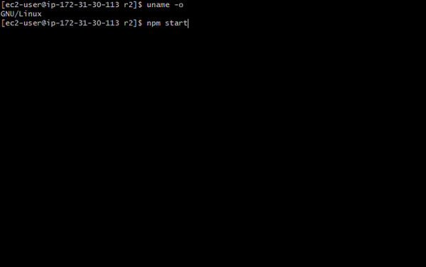

[日本語はこちら](http://qiita.com/bitrinjani/items/3ed756da9baf7d171306)

[](https://travis-ci.org/bitrinjani/r2) [](https://coveralls.io/github/bitrinjani/r2?branch=master)
# R2 Bitcoin Arbitrager

R2 Bitcoin Arbitrager is an automatic arbitrage trading application targeting Bitcoin exchanges.



## Getting Started

1. Install [Node.js](https://nodejs.org) 8.5 or newer.
2. Clone this repository.
  ```bash
  git clone https://github.com/bitrinjani/r2.git
  ```
3. Run `npm install`. (or `yarn`)
```bash
cd r2
npm install
```
4. Rename `config_default.json` in the folder to `config.json`
5. Replace `key` and `secret` fields with your API keys (tokens) and secrets. 
6. Start the application by `npm start` or `yarn start`.
```bash
npm start
```

or

1. Install [Docker](https://docs.docker.com/engine/installation/)
2. Clone this repository.
  ```bash
  git clone https://github.com/bitrinjani/r2.git
  ```
3. Run `docker build` and `docker run`.
  ```
  cd r2
  docker build -t r2:latest .
  docker run --rm -it r2:latest
  ```

### Prerequisites
R2 works on any OS that supports Node.js, such as:
- Windows
- Mac OS
- Linux

#### Supported Exchanges
R2 supports the following exchanges.

|Exchange|Cash|Margin|
|----|------|-----------|
|bitFlyer|✔️|✔️*|
|Quoine|✔️|✔️|
|Coincheck|✔️|✔️|
|bitbank.cc|️️️✔️|| 

*bitFlyer margin trading (BTC-FX/JPY) is available as a [broker plugin](https://github.com/bitrinjani/bitflyer-fx).

## How it works
1. Every 3 seconds, R2 downloads quotes from exchanges.
1. Filters out quotes that are not usable for arbitrage. For example, if `maxShortPosition` config is 0 and the current position is 0 for a broker, the ask quotes for the broker will be filtered out.
1. Calculates the best ask and the best bid from the filtered quotes and checks if the expected profit is larger than the configured minimum value, `minTargetProfitPercent`. If there is no arbitrage opportunity, R2 waits for the next iteration.
1. R2 concurrently sends a buy leg and a sell leg to each broker that offered the best price.
1. R2 checks whether the legs are filled or not for the configured period, say 30 seconds.
1. If the both legs are filled, shows the profit. If one of the legs are not fully filled, R2 tries to send a cover order in order to balance the position. The covering behavior is configurable in `onSingleLeg` config.

After the spread has became smaller than the configured value, `exitNetProfitRatio`, R2 tries to close the pair.

## Architecture Overview
- Pluggable architecture: User can add new exchanges/brokers as an npm package like [bitflyer-fx plugin](https://github.com/bitrinjani/bitflyer-fx)
- Concurrency: All API calls to exchanges are concurrently sent/handled.
- ️Dynamic configuration: User can dynamically update the configuration based on spread statistics by a simple js script, like setting `minTargetProfitPercent` to μ + σ every few seconds.


## Configuration

All configurations are stored in `config.json`.

### Global Config
|Name|Values|Description|
|----|------|-----------|
|language|"ja" or "en"|UI language. Japanese or English.|
|demoMode|true or false|If it's true, the arbitrager analyzes spreads but doesn't send any real trade.|
|priceMergeSize|number|Merges small quotes into the specified price ladder before analyzing arbitrage opportunity.|
|maxSize|number|Maximum BTC size to be sent to brokers.|
|minSize|number|Minimum BTC size to be sent to brokers.|
|minTargetProfitPercent|number|Minimum target profit in percent against notional (= inverted spread %). Profit percentage against notional is calculated by `100 * expected profit / (MID price * volume)`.|
|maxTargetProfit|number|[Optional] Max target profit. This is a safe-guard for abnormal quotes. If the expected profit is larger than this, R2 won't attempt arbitrage.|
|maxTargetProfitPercent|number|[Optional] Max target profit in percent.|
|exitNetProfitRatio|number|R2 attempts to close open pairs when the spread has decreased by this percentage. For example, when the open profit of an open pair is 200 JPY and exitNetProfitRatio is 20(%), R2 closes the pair once the closing cost has became 160.|
|maxTargetVolumePercent|number|[Optional]  In order to execute orders as fast as possible and avoid slippage, R2 checks the volume of the quotes from the exchanges and makes sure the target volume consumes less than this percentage of the volume of the target quote before executing the order|
|iterationInterval|Millisecond|Time lapse in milliseconds of an iteration. When it's set to 3000, the quotes fetch and the spreads analysis for all the brokers are done every 3 seconds|
|positionRefreshInterval|Millisecond|Time lapse in milliseconds of position data refresh. Position data is used to check max exposure and long/short availability for each broker.|
|sleepAfterSend|Millisecond|Time lapse in milliseconds after one arbitrage is done.|
|maxNetExposure|number|Maximum total net exposure. If net exposure qty is larger than this value, Arbitrager stops.| 
|maxRetryCount|number|Maximum retry count to check if arbitrage orders are filled or not. If the orders are not filled after the retries, Arbitrager tries to cancel the orders and continues.|
|orderStatusCheckInterval|Millisecond|Time lapse in milliseconds to check if arbitrage orders are filled or not.|
|stabilityTracker|-|See stabilityTracker config below|
|onSingleLeg|-|See onSingleLeg config below|
|analytics|-|See [ANALYTICS_PLUGIN.md](https://github.com/bitrinjani/r2/blob/master/docs/ANALYTICS_PLUGIN.md)|

#### stabilityTracker config details

R2 automatically disables trading activities on unstable brokers.

- Each broker has its stability index on a scale of one to ten.
- The initial stability index is 10.
- The stability index is decremented each time a broker API call fails.
- The stability index is incremented every time `recoveryInterval` milliseconds has passed.
- R2 disables brokers which has smaller stability index than `threshold` value.

By default, a broker which has failed three API calls within 5 minutes would be disabled for trading for at most 5 minutes.

Default configuration:

```json
...
  "stabilityTracker": {
    "threshold": 8,
    "recoveryInterval": 300000 
  },
...
```

#### onSingleLeg config details

The onSingleLeg config specifies what action should be taken when only one leg is filled.

```json:config.json
...
  "onSingleLeg": {
    "action": "Reverse",
    "actionOnExit": "Proceed",
    "options": {
      "limitMovePercent": 5,
      "ttl": 3000
    }
  },
...
````

- action: Action to be taken when only one leg is opened.
    - Cancel: Cancel the unfilled order.
    - Reverse: After canceling the unfilled order, R2 sends a limit order to the opposite side of the filled order. The limit price depends on limitMovePercent config. 
    - Proceed: After canceling the unfilled order, R2 sends another order to the same side of the unfilled order. The limit price depends on limitMovePercent config.
- actionOnExit: Action to be taken when only one leg is closed. Cancel, Reverse, or Proceed.
- options
    - limitMovePercent: Set the limit price created by the action to the price worse than the original order by limitMovePercent %. 
    - ttl: Time to Live of the limit order created by the action。

### Broker config
|Name|Values|Description|
|----|------|-----------|
|broker|Bitflyer, Quoine or Coincheck|Broker name|
|npmPath|string|npm package name for the broker plugin.|
|enabled|true or false|Enable the broker for arbitrage|
|key|string|Broker API Key|
|secret|string|BrokerAPI Secret|
|maxLongPosition|number|Maximum long position allowed for the broker. R2 won't send orders to the broker if current long position is larger than this value.|
|maxShortPosition|number|Maximum short position allowed for the broker. R2 won't send orders to the broker if current short position is larger than this value.|
|cashMarginType|Cash, MarginOpen, NetOut|Arbitrage order type. Not all options are supported for each exchange. See the table below.|
|commissionPercent|number|Comission percentage for each trade. Commission JPY amount is calculated by `target price * target volume * (commissionPercent / 100)`. Arbitrager calculates expected profit by `inversed spread * volume - commission JPY amount`.|  
|noTradePeriods|list of ["starttime", "endtime"]|See noTradePeriods section below|

#### Supported cashMarginType 

|Exchange|Supported option|
|--------|----------------|
|Bitflyer|Cash|
|Quoine|Cash, NetOut|
|Coincheck|Cash, MarginOpen, NetOut|

Quoine's NetOut is natively handled by Exchange API. Quoine can close multiple positions by one order.
Coincheck's NetOut is artificially handled by R2 because the exchange doesn't support netout operation. Coincheck's NetOut works as below.
1. The arbitrager finds leverage positions with the following conditions.
  - The opposite side of the sending order
  - Almost same amount as the sending order. 'Almost same' here means within 1% difference
2. If the positions are found, the arbitrager closes the oldest one.
3. If not found, the arbitrager opens a new position.

Please note this implementation doesn't close multiple positions by one order.

### noTradePeriods config
The noTradePeriods config specifies the periods when the quotes from the exchange must be ignored. The config is useful for scheduled maintenance periods, e.g. 4:00-4:15 in bitFlyer.

- Example: Exclude bitFlyer from trading activities between 4:00 am to 4:15 am.
```json
    {
      "broker": "Bitflyer",
...
      "noTradePeriods": [["04:00", "04:15"]]
    },
```

- Example: Excludes multiple periods
```json
    {
      "broker": "Bitflyer",
...
      "noTradePeriods": [["04:00", "04:15"], ["9:00", "9:30"]]
    },
```

### Log notification config (Slack, LINE)

R2 can send notification messages to Slack and LINE when it detects the configured keywords in the output logs.

- Example

```json
// config.json
{
...
  "logging": {
    "slack": {
      "enabled": false,
      "url": "https://hooks.slack.com/services/xxxxxx",
      "channel": "#ch1",
      "username": "abc",
      "keywords": ["error", "profit"]
    },
    "line": {
      "enabled": false,
      "token": "TOKEN",
      "keywords": ["error", "profit"]
    }
  }
}
```

#### Slack notification
|Name|Values|Description|
|----|------|-----------|
|enabled|true or false|Enable notification|
|url|string|Slack Incoming Webhook URL|
|channel|string|Slack channel name|
|username|string|Slack user name|
|keywords|string[]|Keyword list|

#### LINE notification
|Name|Values|Description|
|----|------|-----------|
|enabled|true or false|Enable notification|
|token|string|LINE Notify token|
|keywords|string[]|Keyword list|

### Log files
All log files are saved under `logs` directory.

|File name|Description|
|---------|-----------|
|info.log|Standard log file|
|debug.log|Verbose logging, including all REST HTTP requests and responses in JSON format|

## Utility scripts

Several utility scripts are available to close positions, show balances and clear cache.

See [TOOLS.md](https://github.com/bitrinjani/r2/blob/master/docs/TOOLS.md)

## Running the tests
`test` script runs [ts-jest](https://github.com/kulshekhar/ts-jest).

```
npm test
```

## License

This project is licensed under the MIT License - see the [LICENSE](LICENSE) file for details

## Disclaimer

USE THE SOFTWARE AT YOUR OWN RISK. YOU ARE RESPONSIBLE FOR YOUR OWN MONEY. THE AUTHOR HAS NO RESPONSIBILITY FOR YOUR TRADING RESULTS.

## Inspirations
[Blackbird](https://github.com/butor/blackbird), which targets US exchanges. 
